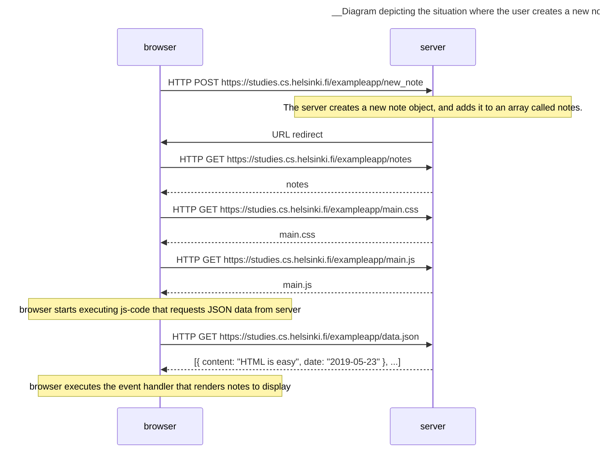
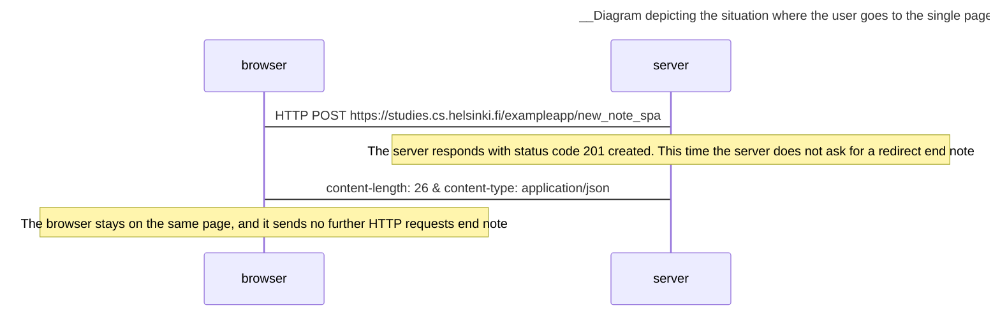

```mermaid
sequenceDiagram
 
    title __Diagram depicting the situation where the user creates a new note__
    participant browser
    participant server

    browser->>server: HTTP POST https://studies.cs.helsinki.fi/exampleapp/new_note

    Note over server: The server creates a new note object, and adds it to an array called notes.
  
    server->>browser: URL redirect
    browser->>server: HTTP GET https://studies.cs.helsinki.fi/exampleapp/notes
    server-->>browser: notes
    browser->>server: HTTP GET https://studies.cs.helsinki.fi/exampleapp/main.css
    server-->>browser: main.css
    browser->>server: HTTP GET https://studies.cs.helsinki.fi/exampleapp/main.js
    server-->>browser: main.js


    Note over browser: browser starts executing js-code that requests JSON data from server
   
    browser->>server: HTTP GET https://studies.cs.helsinki.fi/exampleapp/data.json
    server-->>browser: [{ content: "HTML is easy", date: "2019-05-23" }, ...]

    Note over browser: browser executes the event handler that renders notes to display
   
```

```mermaid
sequenceDiagram
 
    title __Diagram depicting the situation where the user goes to the single page app version of the notes app__
    participant browser
    participant server

    browser->server: HTTP POST https://studies.cs.helsinki.fi/exampleapp/new_note_spa

    note over server:The server responds with status code 201 created. This time the server does not ask for a redirect end note

    server->browser: content-length: 26 & content-type: application/json

    note over browser: The browser stays on the same page, and it sends no further HTTP requests end note 
   
```

